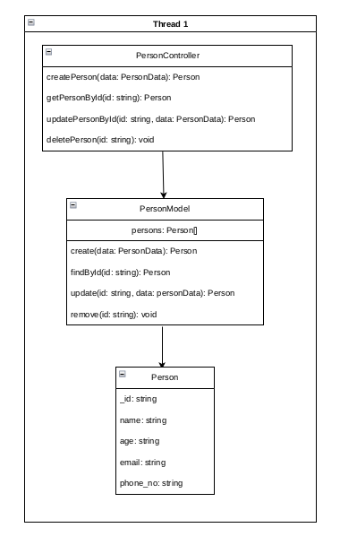

# HNGX Backend Project 2 (Rest API)

## Table of Contents
 - [Description](#description)
 - [Installation](#installation)

## Description
This is a simple Rest API that allows users to create, read, update and delete (CRUD) people's data. The data is stored in a database (MongoDB) and can be accessed via the API endpoints.

## Installation
### Clone the repository
```bash
git clone https://github.com/Dev-180Memes/HNGX-2.git

cd HNGX-2
```
### Install dependencies
```bash
npm install
```
### Run the server
```bash
npm start
```

## API Usage
To use the API, you can use Postman or any other API testing tool of your choice. The API endpoints are as follows:

```
// Add a person
POST https://alert-puce-pelican.cyclic.app/api/persons

// Get a person by ID
GET https://alert-puce-pelican.cyclic.app/api/persons/:id

// Update a person by ID
PUT https://alert-puce-pelican.cyclic.app/api/persons/:id

// Delete a person by ID
DELETE https://alert-puce-pelican.cyclic.app/api/persons/:id
```

The complete API documentation can be found [here](./DOCUMENTATION.md).

## UML Diagram

